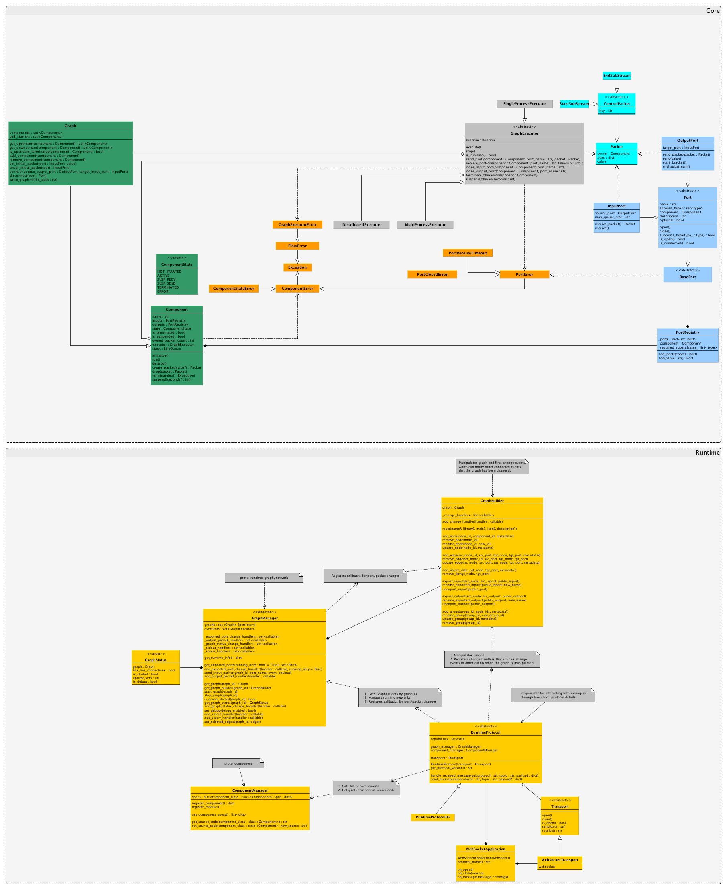

# pflow

[ TODO: Improve documentation ]

Python [flow-based programming](http://www.jpaulmorrison.com/fbp/) implementation that tries to remain as close
to the "classic" approach as possible.

**THIS PROJECT IS STILL IN ITS VERY EARLY STAGES**

To quote J. Paul Morrison:
> In computer programming, Flow-Based Programming (FBP) is a programming paradigm that uses a "data factory" metaphor 
for designing and building applications. FBP defines applications as networks of "black box" processes, which exchange 
data across predefined connections by message passing, where the connections are specified externally to the processes. 
These black box processes can be reconnected endlessly to form different applications without having to be changed 
internally. FBP is thus naturally component-oriented.

## How is this useful?

Drag-and-drop programming!

You can define data flow execution graphs where each process (node) is run in parallel. To define these graphs, you can
use a GUI like [DrawFBP](https://github.com/jpaulm/drawfbp), [NoFlo UI](https://github.com/noflo/noflo-ui), 
or [Flowhub](https://flowhub.io/).

## Getting Started

Run `python setup.py develop` to symlink site-packages to this repo, 
then run the example graphs with `./example.py`.

## Graphs

To define and execute a graph, subclass `pflow.core.Graph`, override `initialize()` to construct the graph,
then run it using a `GraphExecutor` implementation:

    from pflow.executors.single_process import SingleProcessGraphExecutor
    from pflow.components import *
    from pflow.core import Graph

    
    class MyGraph(Graph):
        def initialize(self):
            tail_1 = FileTailReader('TAIL_1')
            self.set_initial_packet(tail_1.inputs['PATH'], '/var/log/system.log')
    
            filter_1 = RegexFilter('FILTER_1')
            self.set_initial_packet(filter_1.inputs['REGEX'],
                                    r' (USER|DEAD)_PROCESS: ')
    
            self.connect(tail_1.outputs['OUT'], filter_1.inputs['IN'])
    
            self.connect(filter_1.outputs['OUT'].connect,
                         ConsoleLineWriter('LOG_1').inputs['IN'])    

    graph = MyGraph('MY_GRAPH_NAME')
    executor = SingleProcessGraphExecutor(graph)
    executor.execute()

Components are connected by their ports by calling `Graph.connect(source_output_port, target_input_port)`.

Any time `Graph.connect()` is called, the components associated with the ports will automatically get added to the
graph. If (in the rare case) you have a graph with a single component, you'll need to register it by calling
`Component.add_component()`.

## Components

You can find some premade components in the `pflow.components` module. If you can't find what you need there,
you can always create a custom component by subclassing `pflow.core.Component`, then overriding the `initialize()` 
and `run()` methods:

    from pflow.core import Component, InputPort, OutputPort
    
    
    class MySleepComponent(Component):
        '''
        Receives input from IN, sleeps for a predetermined amount of time,
        then forwards it to output OUT.
        '''
        def initialize(self):
            self.inputs.add(InputPort('IN'))
            self.outputs.add(OutputPort('OUT'))
           
        def run(self):
            input_packet = self.inputs['IN'].receive_packet()
            time.sleep(5)
            self.outputs['OUT'].send_packet(input_packet)

### Component Design

Rules for creating components:

* The `Component.initialize()` method is used for setting up ports and any initial state.
* The `Component.run()` method is called by the runtime every time there's a new packet arrives on the `InputPort`
  and hasn't been received yet.
* Components will automatically suspend execution after `Component.run()` completes, and will await the next packet
  unless there is no more data to receive and all upstream components have been terminated. In that case, the component
  will terminate execution.
* Call `Component.suspend()` if you need to be explicit about suspending execution (typically done in loops or when 
  waiting for some asynchronous task to complete).
* Calls to `Port.send*()` or `Port.receive*()` implicitly call `Component.suspend()` in the `SingleProcessGraphRuntime`
  while waiting for data to arrive, so that they do not block greenlet execution.
* You should always check that the return value of `Component.receive()` or `Component.receive_packet()` is not the
  sentinel object `EndOfStream`, denoting that the port was closed.
* Call `Component.terminate()` if you need to be explicit about terminating a component.
* Unless you are explicitly calling `Component.suspend()` to wait on an async result, and are making a call to a 
  blocking operation (that gevent patches), you should add a `self.state = ComponentState.SUSPENDED` before the call.

### Component States

| State | Description |
| ----- | ----------- |
| **NOT_STARTED** | Component hasn't started because it hasn't received any data yet (initial state). |
| **ACTIVE** | Component has received data and is actively running. |
| **SUSP_SEND** | Component is waiting for data to send on its output port. |
| **SUSP_RECV** | Component is waiting to receive data on its input port. |
| **TERMINATED** | Component has successfully terminated execution (final state). |
| **ERROR** | Component has terminated execution because of an error (final state). |

### Class Diagram

